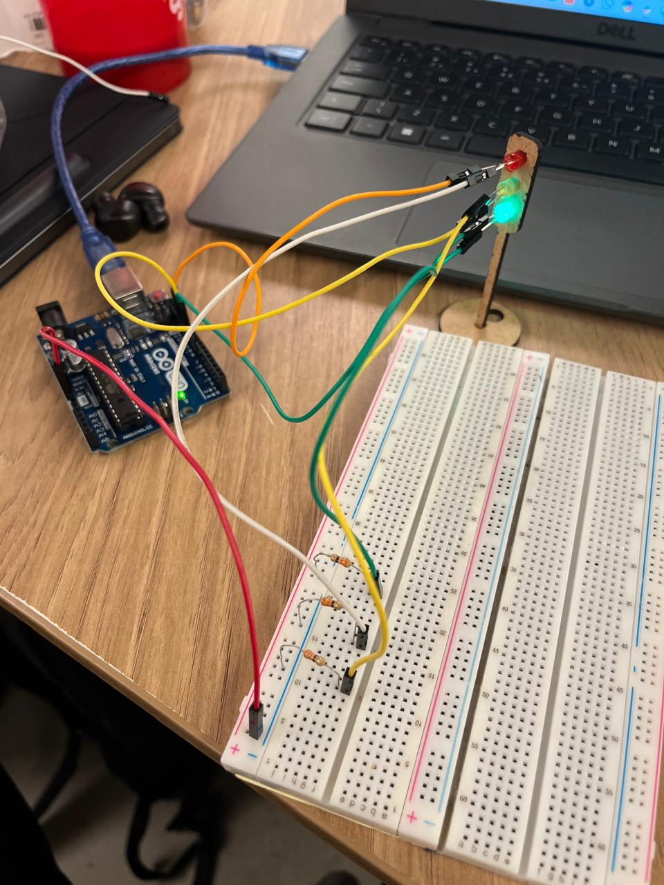
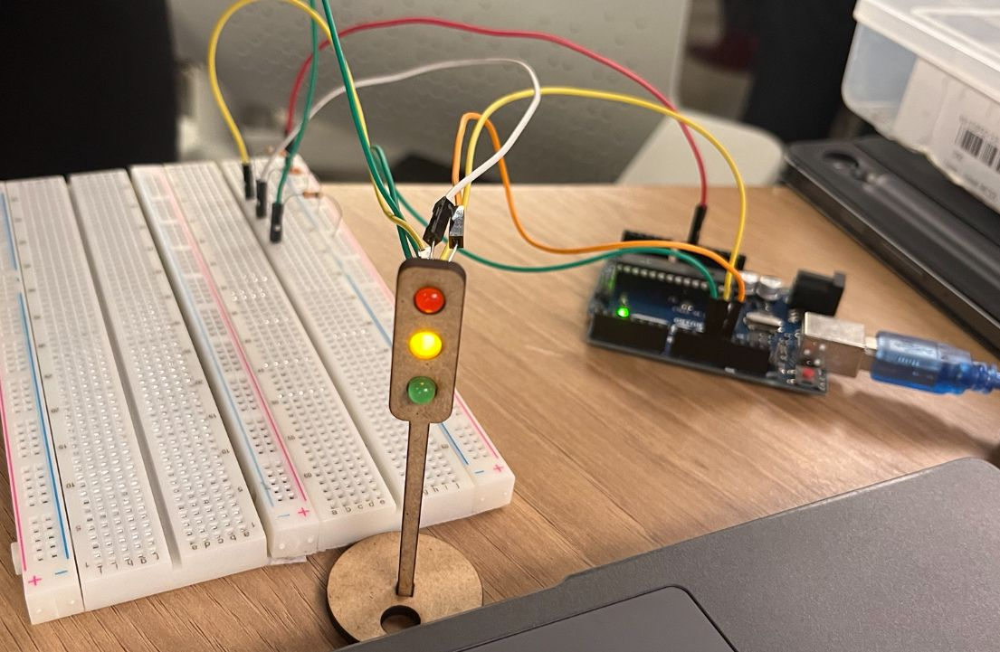

## Projeto Semáforo Offline 
**Aluna:** Júlia Alves de Jesus | **Turma:** 14 | **Data:** 29/10/2024

## 1. Descrição do Projeto
Este projeto implementa o funcionamento de um semáforo utilizando um Arduino UNO, LEDs, resistores 330Ω e uma protoboard. O semáforo alterna entre as fases vermelho, amarelo e verde com tempos definidos.

## 2. Componentes Utilizados
| Componente     | Quantidade 
|----------------|-------|
| LED Vermelho  | 1  |
| LED Amarelo    | 1  |
| LED Verde      | 1| 
| Resistor 330Ω       | 3  | 
| Arduino Uno    | 1 |
| Protoboard     | 1| 
| Fios Jumper    | 7   |

## 3. Montagem
A montagem foi feita conectando 3 LEDs na protoboard no Arduino Uno. O catodo de cada um dos LEDs estava ligado a um resistor de 330Ω. Este último, por sua vez, foi então conectado ao "terra" do arduino (negativo do circuito), e o anodo de cada LED estava ligado também ao arduino, só que em alguma das suas saídas digitais (positivo do circuito).

## 4. Código de Programação
O código para essa atividade foi escrito em C++, utilizando o aplicativo Arduino IDE. Ele é capaz de cumprir a função de acender e desligar 3 LEDs em fases de tempo diferentes, simulando o funcionamento de um semáforo. 

```cpp
// Definição dos pinos dos LEDs
const int ledVermelho = 13;
const int ledAmarelo = 12;
const int ledVerde = 11;

void setup() {
  // Configura os pinos dos LEDs como saída
  pinMode(ledVermelho, OUTPUT);
  pinMode(ledAmarelo, OUTPUT);
  pinMode(ledVerde, OUTPUT);
}

void loop() {
  // Fase 1: LED vermelho aceso por 6 segundos
  digitalWrite(ledVermelho, HIGH);
  digitalWrite(ledAmarelo, LOW);
  digitalWrite(ledVerde, LOW);
  delay(6000); // Mantém o vermelho aceso por 6 segundos

  // Fase 2: LED amarelo aceso por 2 segundos
  digitalWrite(ledVermelho, LOW);
  digitalWrite(ledAmarelo, HIGH);
  digitalWrite(ledVerde, LOW);
  delay(2000); // Mantém o amarelo aceso por 2 segundos

  // Fase 3: LED verde aceso por 2 segundos
  digitalWrite(ledVermelho, LOW);
  digitalWrite(ledAmarelo, LOW);
  digitalWrite(ledVerde, HIGH);
  delay(2000); // Mantém o verde aceso por 2 segundos

  // Fase 4: LED verde aceso por mais 2 segundos (tempo extra para pedestres)
  delay(2000); // Tempo extra com o verde aceso

  // Fase 5: LED amarelo aceso por 2 segundos antes de voltar ao vermelho
  digitalWrite(ledVermelho, LOW);
  digitalWrite(ledAmarelo, HIGH);
  digitalWrite(ledVerde, LOW);
  delay(2000); // Mantém o amarelo aceso por 2 segundos antes de reiniciar o ciclo
}

``` 

## 5. Fotos e vídeo de demonstração
Aqui estão as fotos e o vídeo que demonstram o funcionamento do semáforo offline, durante a aula, com os LEDs acendendo e apagando no tempo especificado.
    
**Link do vídeo:** [Demonstração do Semáforo](semaforo-video.mp4)

**Imagens:** 





## 6. Avaliação de pares na sala e testes

#### [1º Avaliador: Felipe Zillo](avaliacao-pares1.md)

| Critério                                                                                                 | Contempla (Pontos) | Contempla Parcialmente (Pontos) | Não Contempla (Pontos) | Observações do Avaliador |
|---------------------------------------------------------------------------------------------------------|--------------------|----------------------------------|--------------------------|---------------------------|
| Montagem física com cores corretas, boa disposição dos fios e uso adequado de resistores                | **Até 3**              | Até 1,5                            | 0                        |        Contempla! (3 pontos).  **Justificativa do avaliador:** *"Está bem organizado. Conexões certas."*               |
| Temporização adequada conforme tempos medidos com auxílio de algum instrumento externo                  | **Até 3**             | Até 1,5                          | 0                        |    Contempla! (3 pontos). **Justificativa do avaliador:** *"O tempo de cada fase do semáforo está certo."*                       |
| Código implementa corretamente as fases do semáforo e estrutura do código (variáveis representativas e comentários) | **Até 3**              | Até 1,5                          | 0                        |     Contempla! (3 pontos). **Justificativa do avaliador:** *"Está funcionando como deveria."*        |
| Extra: Implmeentou um componente de liga/desliga no semáforo e/ou usou ponteiros no código | **Até 1**              |  Até 0,5                         | 0                        |           Contempla! (1 ponto). **Justificativa do avaliador:** *"O "ir além" seria a utilização da placa MDC (molde), como o professor falou."*          |
|  |                                                             |  | |**Pontuação Total:**  Nota 10. |

---------------------------------------------------------------------------------------------------------


#### [2º Avaliador: Fernando Soares de Oliveira](avaliacao-pares2.md)

| Critério                                                                                                 | Contempla (Pontos) | Contempla Parcialmente (Pontos) | Não Contempla (Pontos) | Observações do Avaliador |
|---------------------------------------------------------------------------------------------------------|--------------------|----------------------------------|--------------------------|---------------------------|
| Montagem física com cores corretas, boa disposição dos fios e uso adequado de resistores                | **Até 3**              | Até 1,5                            | 0                        |        Contempla! (3 pontos).  **Justificativa do avaliador:** *"Realizou bem a organização dos fios, os deixando bem espaçados na protoboard e com cores distintas, o que facilita a compreensão."*               |
| Temporização adequada conforme tempos medidos com auxílio de algum instrumento externo                  | **Até 3**              | Até 1,5                          | 0                        |    Contempla! (3 pontos). **Justificativa do avaliador:** *"Temporarização cronometrada, executada corretamente."*                       |
| Código implementa corretamente as fases do semáforo e estrutura do código (variáveis representativas e comentários) | **Até 3**              | Até 1,5                          | 0                        |     Contempla! (3 pontos). **Justificativa do avaliador:** *"Cumpriu com tudo que está especificado no barema quanto ao código."*        |
| Extra: Implmeentou um componente de liga/desliga no semáforo e/ou usou ponteiros no código | **Até 1**              |  Até 0,5                         | 0                        |           Contempla! (1 ponto). **Justificativa do avaliador:** *"Foi além, implementou os LEDs no molde de MDC (impressão 3D)."*          |
|  |                                                             |  | |**Pontuação Total:**  Nota 10. |


